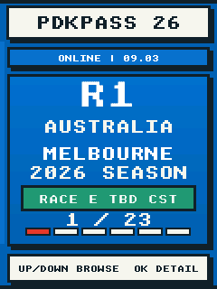
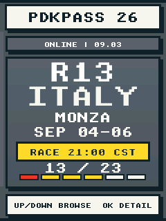
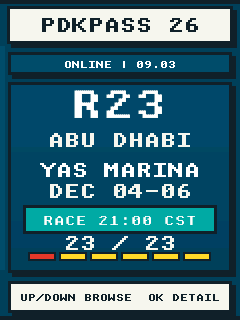

<p align="right">
  <strong>简体中文</strong> · <a href="README.md">English</a>
</p>

# PDKPASS

<p align="center">
  <strong>装在 FoloToy AI Passport 里的 F1 周末通行证。</strong><br>
  赛历 · 车手积分 · 赛道详情 · 各分节前三名
</p>

> **项目状态：**固件构建和主机测试已经通过，原生模拟器可运行正式界面；首次实机
> 验证仍需等待设备到货后完成。

<table>
  <tr>
    <td></td>
    <td></td>
    <td></td>
  </tr>
  <tr>
    <td align="center">澳大利亚</td>
    <td align="center">意大利</td>
    <td align="center">阿布扎比</td>
  </tr>
</table>

<p align="center"><sub>画面由原生模拟器直接运行正式界面代码生成，不是设计稿。</sub></p>

## PDKPASS 能做什么

PDKPASS 将 AI Passport 变成离线优先的 F1 随身伴侣：打开就能看到当前或下一站，
还可以浏览全年赛历、车手积分、赛道详情，以及各个比赛分节的前三名。

- 按北京时间自动选择当前或下一站，无需手动切换日期。
- 每站使用独立配色，同时让首页、赛历、详情、积分、成绩、配网和赛季结束页面保持
  同一套赛车通行证视觉语言。
- 内置完整 2026 赛历和每站不同的赛道轮廓，首次离线也能使用。
- 联网后下载当前赛季与积分榜，并将最后一次有效数据留在设备中供离线查看。
- 成绩可覆盖 FP1、FP2、FP3、冲刺排位、冲刺赛、排位赛与正赛，并缓存各分节前三名。
- 闲置后自动降低亮度并关闭背光。

## 按键

| 页面 | 上键 / 下键 | 确定键 | 长按确定键 |
| --- | --- | --- | --- |
| 下一场 | 积分榜 / 赛历 | 比赛详情 | — |
| 赛历 | 选择比赛 | 比赛详情 | 首页 |
| 积分榜 | 滚动车手 | — | 首页 |
| 比赛详情 | 上一场 / 下一场 | 分节成绩 | 返回 |
| 分节成绩 | 上一个 / 下一个分节 | 比赛详情 | 比赛详情 |

## 不需要安装手机 App

不需要安装手机 App。设备没有保存可用网络时，首页会显示临时 Wi-Fi 名称、密码和
`192.168.4.1`：

1. 用手机连接画面中的 `PDKPASS-XXXX` Wi-Fi。
2. 在手机浏览器打开 `http://192.168.4.1`。
3. 填写 2.4 GHz Wi-Fi 名称和密码，再按 **Connect**。

PDKPASS 会先验证连接，成功后才保存凭据。密码错误时配网页会继续保留，可以重新填写。
之前保存的网络连续重连失败 5 次后，也会自动重新进入配网状态。

顶部状态会依次显示 `SETUP`、`WIFI...`、`TIME...` 和 `ONLINE`。时间同步后，
设备会自行计时，并在北京时间每天 00:00、当前分站的切换点，以及网络恢复后检查
赛季数据。联网赛历会在记录的正赛结束后自动切换到下一站；内置离线回退赛历则使用
计划正赛发车后 4 小时作为切换点。最后一站结束后显示 `SEASON COMPLETE`。

## 分节成绩

分节结束后，打开对应分站详情并按确定键，即可浏览 FP1、FP2、FP3、冲刺排位、
冲刺赛、排位赛和正赛成绩。PDKPASS 会等待记录的分节结束时间至少 30 分钟，再查询
前三名；后台采用低频重试，因此免费成绩通常会在结束后约 30–40 分钟出现，缓存成功后
可离线查看。普通周末不存在的冲刺分节会显示 `NO SESSION`。

历史分节名次与车手资料来自非官方的
[OpenF1 API](https://openf1.org/docs/)。PDKPASS 使用无需身份验证的历史接口，不会在
固件中写入 OpenF1 账号、密码或访问令牌。

## 赛季数据与离线行为

首次使用时的内置回退数据，是 2026 年 8 月 31 日获取的离线快照，来源为
[F1 官方 2026 赛历](https://www.formula1.com/en/racing/2026)与
[F1 官方车手积分榜](https://www.formula1.com/en/results/2026/drivers)。页面中的比赛
时间已转换为中国标准时间（UTC+8）。

第一次成功联网后，PDKPASS 会下载并保存当前北京时间年份的 Grand Prix 赛历，以及
最近一场已结束正赛后的车手积分。跨年时，只有 OpenF1 为新年份返回至少一场有效的
Grand Prix，设备才会切换；否则继续保留上一赛季，并在下一个检查时点重试。设备一次
只保存一个当前赛季，最多包含 24 场比赛、24 名车手，以及 7 类分节的前三名缓存；
新赛季确认成功后，上一赛季缓存才会被替换。

最近一次有效时间、已确认赛季、积分榜和已下载的前三名都会保留供离线查看。如果设备
长时间彻底断电，重新联网后即可刷新。动态赛历、积分榜、分节名次和车手资料来自非官方的
[OpenF1 API](https://openf1.org/docs/)。

### 赛道轮廓来源

内置 2026 赛道轮廓由创作者本机 Apex 赛道资源重新采样为 48 段紧凑坐标。该资源的
元数据注明：大多数赛道经 OpenF1 的 `circuit_info_url` 引用 MultiViewer，雪邦使用
OpenStreetMap 几何，Madring 参考其官方赛道图。PDKPASS 只内置重新采样后的坐标，不会
复制源 JSON、SVG 或地图作品。

OpenF1 将详细赛道信息标注为由
[MultiViewer](https://multiviewer.app/docs/)提供；雪邦几何归属
[OpenStreetMap 贡献者](https://www.openstreetmap.org/copyright)。当前用途是独立、非商业
车迷项目；如需商业分发，应先重新核对相关来源条款。

## 在 macOS 上体验正式界面

仓库内置原生模拟器，直接运行与固件相同的 PDKPASS 页面、导航、分站主题、赛道轮廓、
积分榜和成绩布局。

```bash
git clone https://github.com/LeopardDennis/ai-passport-pdkpass.git
cd ai-passport-pdkpass
./tools/pdkpass-simulator/run.sh
```

使用 `--race 1` 至 `--race 23` 可以直接打开指定分站。键盘操作、无窗口截图和历史成绩
同步方法见[模拟器说明](tools/pdkpass-simulator/README.zh_CN.md)。

## 构建固件

使用 ESP-IDF 5.5.3，并执行：

```bash
./tools/validate.sh --static
./tools/validate.sh --firmware
```

仅分发通过验证的 `build/FoloToy-AI-Passport-full.bin`。
完整构建流程、刷机注意事项和 Recovery 保护要求见
[构建与测试说明](docs/development/build-and-test.zh_CN.md)。

## 文档

- [文档索引](docs/INDEX.zh_CN.md)
- [原生模拟器](tools/pdkpass-simulator/README.zh_CN.md)
- [构建与测试](docs/development/build-and-test.zh_CN.md)
- [BLE 与 Recovery 兼容性](docs/development/ble-recovery-compatibility.zh_CN.md)

## 许可与声明

源代码使用 [MIT License](LICENSE)。

PDKPASS 是独立车迷项目，与 Formula 1、FIA 或 FoloToy 没有隶属或背书关系。
Formula 1 及相关标识归各自权利人所有。
